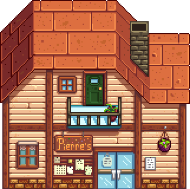
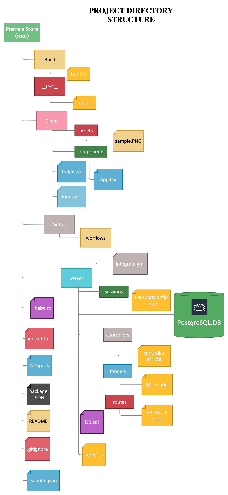
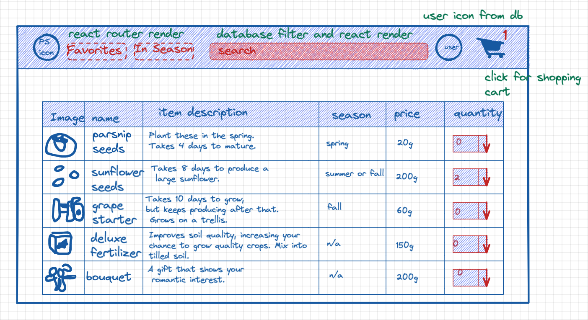
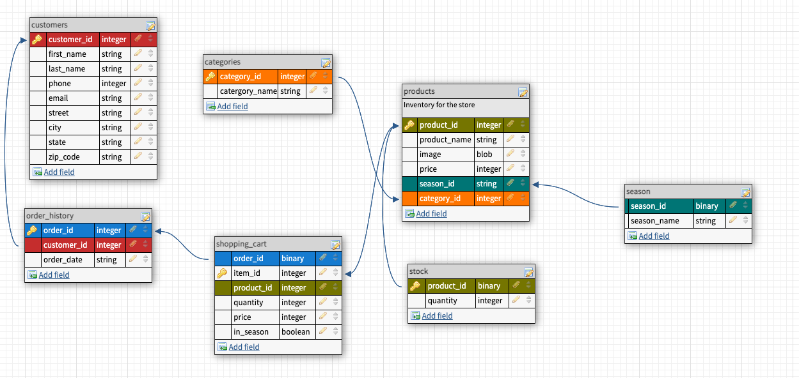
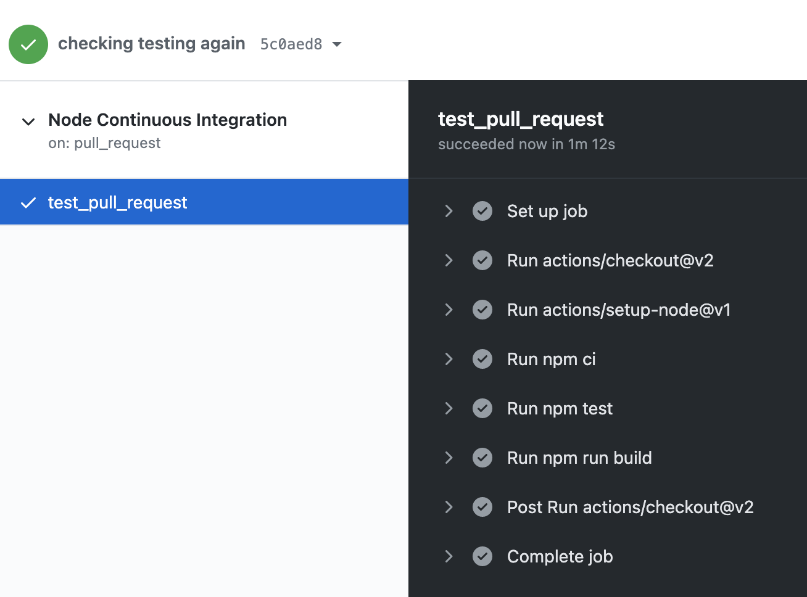
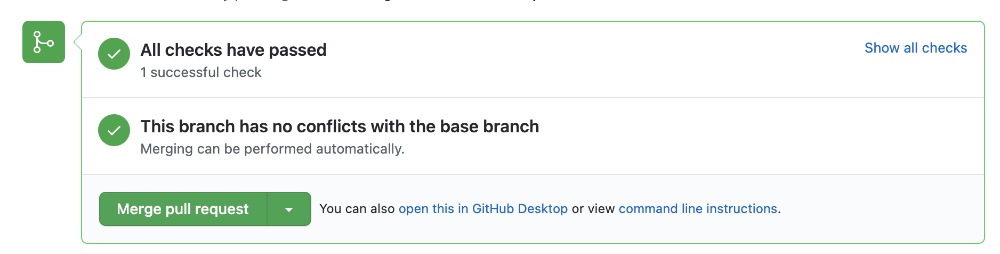

# Pierre's Store

    

A mock e-commerce website based off of Stardew Valley.

<h2 align="center">Table of Contents</h2>

* [FolderStructure]()
* [Wireframe]()
* [Database Structure and Overview]()
* [Test Driven Development]()
* [Dev Ops with Github Actions]()
* [License]()

<h2 href="#FS" >Folder Structure</h2>

<h2 href="#Wireframe" >Wireframe</h2>

<h2 href="#Database" >Database Structure and Overview</h2>

<h2 href="#Test" >Test Driven Development</h2>
<h2 href="#Devops" >Dev Ops with Github Actions</h2>

<h2 href="#License" >License</h2>

This product is licensed under the MIT License.

<h3 align="left">Languages and Tools:</h3>

 
    <a href="https://www.typescriptlang.org/" target="_blank">   
  

